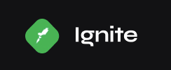
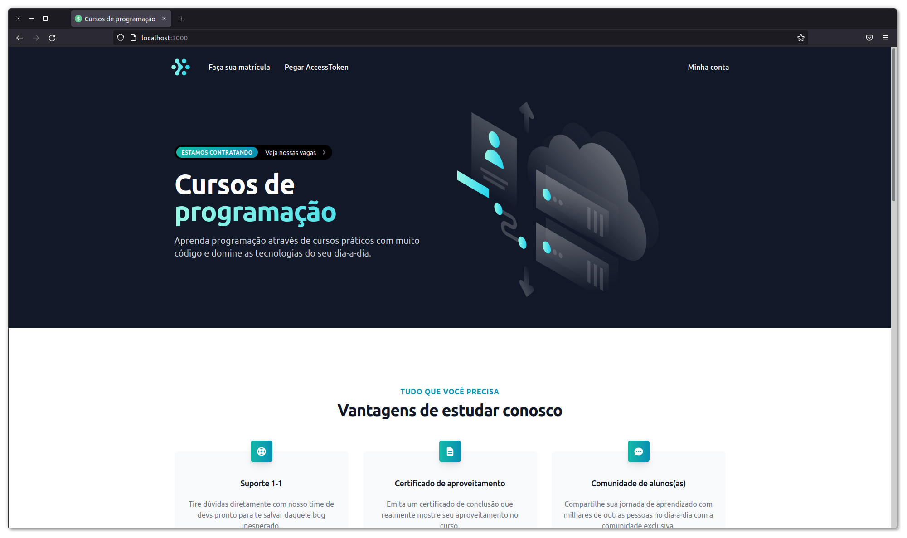

  

    
  

  <h4 align="center">ignitelab | Building a microservice and consuming it on Next.js with Graphql.</h4>

## Resumo

  <ol>
    <li><a href="#visão-geral-do-projeto">Visão geral do projeto</a></li>
    <li><a href="#sobre-o-projeto">Sobre o projeto</a></li>
    <li><a href="#tecnologias-utilizadas">Tecnologias utilizadas</a></li>
    <li><a href="#instalação-e-utilização">Instalação e utilização</a></li>
  </ol>

## Visão geral do projeto

    

## Sobre o projeto

Criação de dois micro-serviços separados, onde cada um terá responsabilidades diferentes,
e vão se comunicar através do Apache Kafka. O primeiro micro-serviço tratará as rotinas de
compras de cursos dentro da aplicação (purchases microservice). Já o segundo, fará o controle
das salas de aulas (classroom microservice). O frontend fará o consumo das informações através
do GraphQl.

## Tecnologias utilizadas

As principais tecnologias utilizadas na construção deste projeto foram: 

* [Apache Kafka](https://kafka.apache.org/)
* [Docker / Docker Compose](https://docs.docker.com/compose/install/)
* [Prisma](https://www.prisma.io/)
* [NestJS](https://docs.nestjs.com/)
* [GraphQL](https://graphql.org/)
* [Apollo Client (GraphQL)](https://www.apollographql.com/docs/react/)
* [Auth0](https://auth0.com/)
* [JWT](https://jwt.io/)
* [Next.js](https://nextjs.org/)
* [Tailwind CSS](https://tailwindui.com/)
* [Codegen](https://www.graphql-code-generator.com/)

## Instalação e utilização

Instruções de instalação do projeto em seu computador.

### Pré-requisitos 

Instalações necessárias antes de executar o projeto.

1. Node
2. Yarn
3. Git
4. Docker / Docker Compose
  
### Instalação

1. Clone o projeto em seu computador

2. Dentro da pasta raiz haverá o arquivo `docker-compose.yml`, você deve executa-lo
com o comando `$ docker-compose up -d`. Lembre-se de checar se a porta 5432 está disponível.
Também é necessário verificar se os 3 containers inciaram de forma correta, muitas vezes o
container do apache kafka não incia, pois depende da inicialização do zookeeper.

3. Para baixar as dependências do projeto, você deve acessar as pastas    
`classroom`, `purchases`, `gateway` e `web`, rodando o comando `$ yarn` dentro das mesmas.

4. Dentro da pasta `classroom` e `purchases`, rode o comando `$ yarn prisma migrate dev`,
para rodar as migrations no banco de dados do docker.

5. Dentro `classroom`, `purchases` e `web`, crie um arquivo `.env`, preenchendo as variáveis 
necessárias para a execução do projeto.

6. Para inciar os projetos em modo development execute:
  6.1. `classroom`: `$ yarn dev:classroom` -> iniciado na porta: 3334
  6.2. `purchases`: `$ yarn dev:purchases` -> iniciado na porta: 3333
  6.3. `gateway`: `$ yarn dev:gateway` -> iniciado na porta: 3332
  6.5. `web`: `$ yarn dev:web` -> iniciado na porta: 3000

7. Para acessar a aba do GraphQL, basta abrir o navegador e digitar `http://localhost:3332(3/4)/graphql`

8. Para acessar o Prima Studio, basta rodar o comando `$ yarn prisma studio` e abrir
o navegador na porta `http://localhost:5555`

 
 
<h4 align="center"><a href="#top">Voltar ao Início</a></h4>

"Estabilidade não existe" - Flavio Augusto
